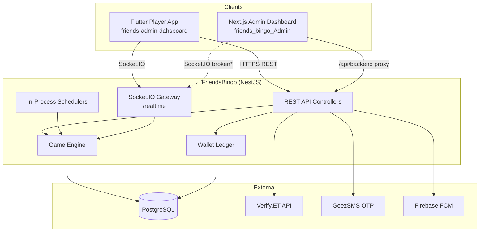
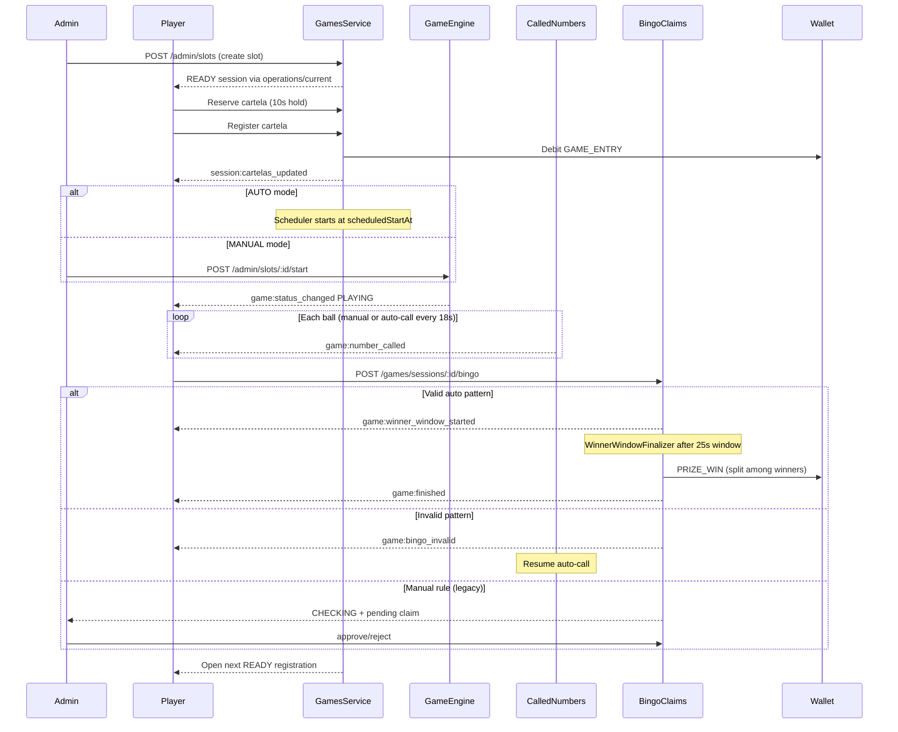
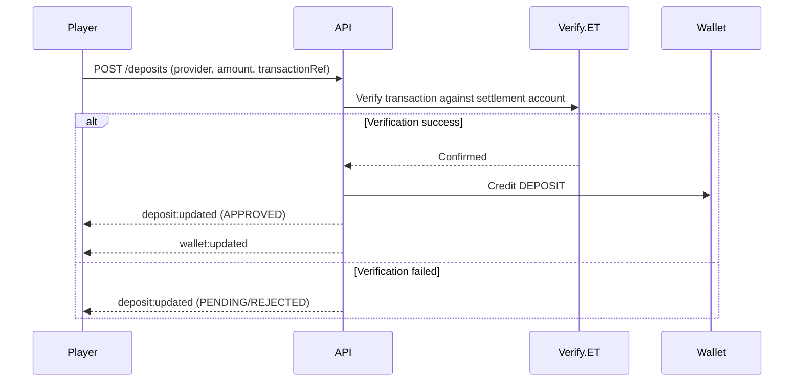
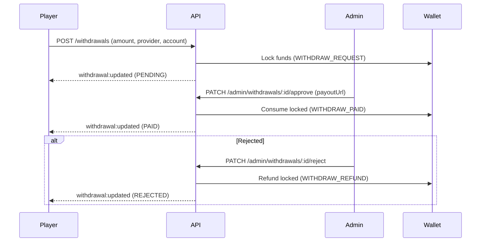
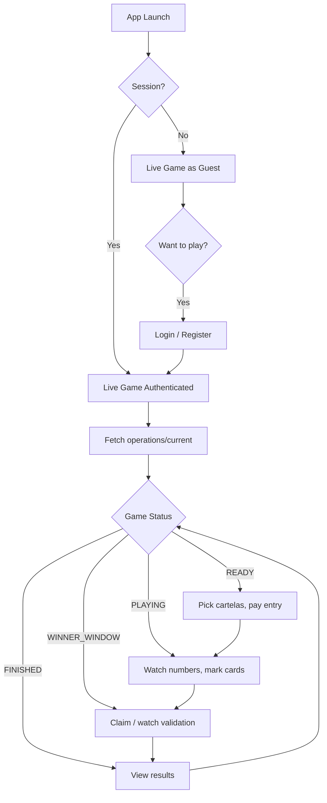

# Friends Bingo — Complete Game Flow & Production Readiness Documentation

**Date:** July 8, 2026  
**Scope:** Backend (`FriendsBingo`), Player Mobile App (`friends-admin-dahsboard`), Admin Dashboard (`friends_bingo_Admin`)  
**Purpose:** End-to-end documentation of game flow, system architecture, integration contracts, and a prioritized roadmap to production readiness.

---

## Table of Contents

1. [Executive Summary](#1-executive-summary)
2. [Project Map](#2-project-map)
3. [System Architecture](#3-system-architecture)
4. [Core Concepts](#4-core-concepts)
5. [Complete Game Lifecycle](#5-complete-game-lifecycle)
6. [Game Categories & Rules](#6-game-categories--rules)
7. [Financial Flows](#7-financial-flows)
8. [Authentication & Authorization](#8-authentication--authorization)
9. [Real-Time Architecture](#9-real-time-architecture)
10. [REST API Reference](#10-rest-api-reference)
11. [Player Mobile App Flow](#11-player-mobile-app-flow)
12. [Admin Dashboard Flow](#12-admin-dashboard-flow)
13. [Database Model Overview](#13-database-model-overview)
14. [Background Jobs & Schedulers](#14-background-jobs--schedulers)
15. [Integration Contracts](#15-integration-contracts)
16. [Production Readiness Assessment](#16-production-readiness-assessment)
17. [Recommended Fixes & Improvements](#17-recommended-fixes--improvements)
18. [Production Deployment Checklist](#18-production-deployment-checklist)
19. [Appendix: Status Transition Rules](#19-appendix-status-transition-rules)

---

## 1. Executive Summary

Friends Bingo is a real-money online bingo platform targeting the Ethiopian market. The system consists of three applications:

| Component | Technology | Role |
|-----------|------------|------|
| **FriendsBingo** | NestJS 11 + Prisma + PostgreSQL + Socket.IO | Backend API, game engine, wallet ledger |
| **friends-admin-dahsboard** | Flutter (misnamed folder) | Player mobile app (`friends_bingo_app`) |
| **friends_bingo_Admin** | Next.js 16 + React 19 | Admin web dashboard |

### Current State

- **Game logic is mature and functionally complete.** The backend owns all game state; clients render and react to canonical snapshots and socket events.
- **Mobile ↔ backend integration is end-to-end wired.** Every socket event has a Flutter handler; every required HTTP endpoint is consumed.
- **Admin dashboard is operationally capable** for game control, finance approval, reporting, and messaging — but real-time sockets are not connected due to an auth architecture mismatch.
- **Not production-ready yet** due to infrastructure gaps (single-instance sockets), release signing (mobile), admin socket auth, and several polish items.

### Design Principle

> **Backend decides, clients render.**  
> `GameSession.status` and `GET /games/operations/current` are the canonical sources of truth. Clients must not invent game state from partial socket payloads.

---

## 2. Project Map

```
D:/PROJECTS/bingo/
├── FriendsBingo/                  ← Backend (NestJS API + game engine)
│   ├── src/
│   │   ├── auth/                  OTP, JWT, refresh tokens
│   │   ├── games/                 Slots, sessions, registration, queue
│   │   ├── game-engine/           Start game, finish, no-winner
│   │   ├── game-rules/            Pattern evaluators (FULL_HOUSE, MIX_*)
│   │   ├── called-numbers/        Ball drawing
│   │   ├── bingo-claims/          Claim validation, winner window, payouts
│   │   ├── cartelas/              75-ball card catalog
│   │   ├── wallet/                Balance, ledger, locked funds
│   │   ├── deposits/              Verify.ET auto-approval
│   │   ├── withdrawals/           Admin-reviewed payouts
│   │   ├── realtime/              Socket.IO gateway
│   │   └── admin/                 Admin REST API
│   ├── prisma/schema.prisma       Database schema
│   └── docs/                      Backend documentation
│
├── friends-admin-dahsboard/       ← Player MOBILE app (Flutter)
│   └── lib/src/features/
│       ├── games/                 Live bingo, registration, claims
│       ├── wallet/                Deposit, withdraw
│       ├── auth/                  Login, OTP, PIN lock
│       └── home/                  Player dashboard shell
│
└── friends_bingo_Admin/           ← Admin WEB dashboard (Next.js)
    └── app/(admin)/
        ├── games/                 Game operations console
        ├── deposits/              Deposit approval
        ├── withdrawals/           Withdrawal approval
        └── reports/               Financial & game reports
```

> **Note:** The folder `friends-admin-dahsboard` is misleadingly named — it is the **player mobile app**, not an admin dashboard.

---

## 3. System Architecture



\* Admin socket connection is broken — see [Section 16](#16-production-readiness-assessment).

### Tech Stack

| Layer | Technology |
|-------|------------|
| Backend framework | NestJS 11, TypeScript |
| ORM / DB | Prisma 7, PostgreSQL 16 |
| Real-time | Socket.IO (`@nestjs/websockets`) |
| Auth | JWT access + refresh tokens, bcrypt passwords |
| Payments | Verify.ET (CBE, Telebirr, Awash, BOA) |
| SMS | GeezSMS (OTP delivery) |
| Push | Firebase Admin SDK (FCM) |
| Mobile | Flutter 3.x, Riverpod, go_router, Dio, socket_io_client |
| Admin | Next.js 16, React 19, TanStack Query, Tailwind, shadcn/ui |

---

## 4. Core Concepts

### GameSlot vs GameSession

| Entity | Purpose | Lifetime |
|--------|---------|----------|
| **GameSlot** | Queue position holder and game template. Defines rule, fees, category, operation mode, `sortOrder`. | Permanent until cancelled/removed |
| **GameSession** | One actual play round. Holds players, cartelas, called numbers, prize pool, status. | Single round: created → finished → archived |

**Key rule:** `GameSession.status` is the **canonical source of truth** for game state. `GameSlot.status` is a derivative field synchronized from the active session.

### The Queue

The queue is not a separate entity — it is a **view** of `GameSlot` records:

```sql
SELECT * FROM game_slot
WHERE status = 'NEXT' AND category != 'BIG_GAME'
ORDER BY sortOrder ASC;
```

### Confusing but Normal: NEXT Slot + READY Session

A `GameSlot` can be `NEXT` while its `GameSession` is `READY`. This means:
- The slot is still in queue identity (`sortOrder` matters)
- The current session is open for registration
- When the session starts (`PLAYING`), the slot status updates to `PLAYING`

### Operations Snapshot (`GET /games/operations/current`)

The canonical "what's happening now" API. Selection priority:

1. `liveGame` — first session with status `PLAYING` or `WINNER_WINDOW`
2. `checkingGame` — first session with status `CHECKING`
3. `registrationOpenGame` — first `READY` session by slot `sortOrder`, else first `NEXT` slot
4. `queue` — remaining `READY` + `NEXT` items by `sortOrder`

Cache: 500ms TTL, invalidated on state changes.

### Global Invariant

**At most one active session globally** where active = `PLAYING` | `CHECKING` | `WINNER_WINDOW`. Multiple `READY` sessions may exist simultaneously.

---

## 5. Complete Game Lifecycle

### Status Machine

```
NEXT → READY → PLAYING → CHECKING → FINISHED
                      ↘ WINNER_WINDOW → FINISHED
                      ↘ NO_WINNER
Any cancellable state → CANCELLED
```

| Status | Meaning |
|--------|---------|
| `NEXT` | Slot queued, no session yet (or session not started) |
| `READY` | Registration open (countdown / scheduled start) |
| `PLAYING` | Numbers being called |
| `CHECKING` | Manual bingo claim pending admin review |
| `WINNER_WINDOW` | Valid auto claim(s); others can join window |
| `FINISHED` | Winners paid, slot requeued or removed |
| `NO_WINNER` | All 75 balls called, grace expired, no valid winner |
| `CANCELLED` | Refunded, reason stored |

### Phase-by-Phase Flow



---

### A. Slot Creation (Admin)

**Endpoint:** `POST /admin/slots`  
**Service:** `GamesService.createGameSlot()` (`src/games/games.service.ts`)

1. Validates game rule, category (`NORMAL`, `BONUS`, `BIG_GOTD`, `BIG_GAME`), operation mode (`MANUAL` / `AUTO`)
2. Assigns queue `sortOrder` with rule diversity in top 5 positions
3. For **AUTO** normal games: may create a `READY` session immediately with `scheduledStartAt`
4. For **BIG_GAME**: creates `READY` session with `registrationOpensAt` / `scheduledStartAt`; only one active big game allowed

---

### B. Registration Opening

**AUTO mode:** `PostGameRegistrationOpenerService` runs on 1s scheduler tick:
- Checks: no active game, no recent finished game (within `finishedResultDisplaySeconds` grace), no due Big Game
- Finds queue head (`NEXT` slot, lowest `sortOrder`, `AUTO` mode)
- Creates `READY` session with `scheduledStartAt = now + registrationDurationSeconds` (default 180s)

**MANUAL mode:** First player registration on a `NEXT` slot triggers session creation via `resolveRegistrationSessionForSlot()`.

---

### C. Cartela Selection & Registration (Player)

All registration uses REST (not sockets):

| Step | Endpoint | Details |
|------|----------|---------|
| Browse catalog | `GET /cartelas` | Paginated 75-ball card list |
| View board | `GET /cartelas/:id/board` | 5×5 number grid |
| Reserve (hold) | `POST .../cartelas/:cartelaId/reserve` | Default 10s hold; bulk hold 120s |
| Confirm reservation | `POST /reservations/:id/confirm` | Converts hold to registration |
| Direct register | `POST .../register-cartela` | Single or bulk endpoints |

**Registration logic** (`games.service.ts`):
- Session must be `READY`, `PLAYING`, or `CHECKING`
- Enforces per-player cartela limits (bonus: 5 default)
- Locks cartelas used in concurrent live rounds (pool isolation: standard vs big-game)
- Payment via `resolveRegistrationAccounting()`:
  - **NORMAL:** wallet debit or `bonusCartelaBalance`
  - **BONUS:** free entry
  - **BIG_GAME / BIG_GOTD:** fixed prize economics
- Increments `prizeAmount` and `companyRevenue` per cartela (except bonus)
- Emits `session:cartelas_updated` (batched ~ms) and `session:prize_updated`

**Economics (normal game defaults):**
- Entry: 10 ETB → Prize pool +8 ETB, company fee +2 ETB per cartela

---

### D. Game Start

**Single entry point:** `GameEngineService.startGame(slotId)`

| Mode | Trigger |
|------|---------|
| **AUTO** | `GameAutoStartSchedulerService` when `scheduledStartAt` elapses and cartelas exist |
| **MANUAL** | Admin `POST /admin/slots/:id/start` |

**What happens:**
1. Transition `READY` → `PLAYING`
2. Set slot status to `PLAYING`
3. Enable auto-call for AUTO mode
4. Emit `game:status_changed`, `game:operation_updated`

**Empty session handling:** AUTO scheduler cancels with `no_players` reason → refund via `GameLifecycleService.cancelSession()`.

---

### E. Number Calling

| Mode | Mechanism | Default Interval |
|------|-----------|------------------|
| **Manual** | Admin `POST /admin/sessions/:id/call-number` | On demand |
| **Auto** | `AutoCallService` picks random uncalled 1–75 ball | 18 seconds |

Each call:
1. Creates `CalledNumber` record with letter (B/I/N/G/O) + order
2. Emits `game:number_called`
3. At ball 75: starts **no-winner grace** (default 360s)

---

### F. Bingo Claims & Win Detection

**Player claim:** `POST /games/sessions/:id/bingo` with `gameCartelaId`

**Service:** `BingoClaimsService.claimBingo()` (`src/bingo-claims/bingo-claims.service.ts`)

1. Emits `game:bingo_checking` immediately for UX
2. Loads cartela + called numbers; evaluates via `GameRuleEvaluationService`
3. **Late-claim detection:** pattern must complete on the latest called number (`winning-ball.util.ts`)

**Auto rules** (FULL_HOUSE, MIX_* patterns):

| Outcome | Action |
|---------|--------|
| **Invalid** | Cartela `BLOCKED`, claim `INVALID`, emit `game:bingo_invalid`, resume auto-call |
| **Valid (first)** | `PLAYING` → `WINNER_WINDOW`, cartela `WINNER`, emit `game:winner_window_started` |
| **Valid (subsequent)** | Emit `game:winner_window_joined` (within 25s window) |

**Manual rule** (legacy, if present in DB):
- Creates `PENDING` claim → session → `CHECKING`
- Admin approves/rejects via `PATCH /admin/bingo-claims/:id/approve|reject`

---

### G. Payouts

Prizes are **not** paid at claim time.

**Finalization:** `WinnerWindowFinalizerService` (1s tick) or admin `PATCH /admin/sessions/:id/finalize-winner-window` after `winnerWindowEndsAt + claimGraceMs`.

1. Splits `prizeAmount` across all `isWinner` cartelas (`splitPrizeAmount`)
2. Credits wallets: `WalletTransactionType.PRIZE_WIN`, reference `GAME_CARTELA`
3. Session → `FINISHED`, `restoreSlotAfterSession()` requeues or removes slot
4. Emits `game:finished`, `wallet:updated`

---

### H. No Winner / Cancellation

**No winner:**
- After 75th ball + grace period (360s) with no valid claim
- Session → `NO_WINNER`, cartelas blocked
- No refunds (stakes already in prize pool)

**Cancellation** (single owner: `GameLifecycleService.cancelSession()`):
- Refunds all paid cartelas (`REFUND` ledger entries)
- Marks cartelas `CANCELLED`
- Session → `CANCELLED`
- Restores slot to queue
- Emits `game:cancelled` + `wallet:updated`

**Cancel paths:**
- Admin force-cancel
- Admin slot cancel
- AUTO scheduler empty-session skip

---

### I. Post-Game Queue Restoration

`GameQueueService.restoreSlotAfterSession(slotId)`:
1. If `removeAfterFinish` flag: slot → `CANCELLED` (removed)
2. Else: slot → `NEXT`, `sortOrder = max + 1` (requeued)
3. Does NOT create new session — `PostGameRegistrationOpenerService` handles that on next scheduler tick

---

## 6. Game Categories & Rules

### Categories

| Category | Entry Fee | Prize Source | Queue Behavior |
|----------|-----------|--------------|----------------|
| `NORMAL` | 10 ETB (configurable) | Per-cartela pool (+8 ETB each) | Standard queue |
| `BONUS` | Free | Fixed `fixedPrizeAmount` from slot | Higher priority than NORMAL |
| `BIG_GOTD` | Special economics | Fixed prize | Separate from normal queue |
| `BIG_GAME` | Special economics | Fixed prize | Scheduled event, blocks normal games when due |

### Game Rules (Pattern Keys)

| Rule Key | Description |
|----------|-------------|
| `FULL_HOUSE` | All numbers on card marked |
| `MIX_01` | Two columns + two rows + one diagonal |
| `MIX_02` | Four squares |
| `MIX_03` | Three columns + one diagonal |
| `MIX_04` | Big T + two squares |
| `MIX_05` | Five lines |
| `MIX_06` | Three lines without free space |
| `MIX_07` | Big L + one diagonal |
| `MIX_08` | Two rows + one square |
| `MIX_09` | Columns + rows + diagonal |
| `MIX_10` | Seven lines |
| `MIX_11` | Three squares |
| `MIX_12` | Three lines touching free space |
| `MIX_13` | Two columns + two rows |
| `MIX_14` | One line with free + two lines without free |

Rules are stored in `GameRule` table with JSON pattern definitions. Evaluators in `src/game-rules/evaluators/`.

### Big Game Priority

1. **Due Big Game** (`scheduledStartAt <= now`) blocks all normal games
2. **Future Big Game** does not block normal games
3. Big Game never appears in normal queue — shown separately via `GET /games/big-game/current`

---

## 7. Financial Flows

### Wallet Model

| Field | Purpose |
|-------|---------|
| `balance` | Available funds |
| `lockedBalance` | Funds locked for pending withdrawals |
| `bonusCartelaBalance` | Free cartela credits (default 10 for new users) |

All wallet mutations go through idempotent ledger entries (`WalletTransaction` with unique `userId+type+referenceType+referenceId`).

### Deposit Flow



**Providers:** CBE, Telebirr, Awash, BOA  
**Settlement accounts:** Configured via env vars (`CBE_*`, `TELEBIRR_*`, etc.)  
**Dev bypass:** `PAYMENT_MOCK_VERIFICATION_ALLOWED=true`

**Mobile deposit UI:**
- CBE and Telebirr active
- Awash and BOA marked "Coming Soon"
- Telebirr supports receipt OCR (ML Kit) for auto-fill

### Withdrawal Flow



### Game Stakes Ledger

| Event | Transaction Type | When |
|-------|-----------------|------|
| Cartela registration | `GAME_ENTRY` | At registration |
| Game cancellation | `REFUND` | On cancel |
| Prize win | `PRIZE_WIN` | At winner-window finalize |

---

## 8. Authentication & Authorization

### Player Auth (Mobile)

| Step | Endpoint | Details |
|------|----------|---------|
| Register | `POST /auth/register` | Phone + password + OTP |
| Login | `POST /auth/login` | Phone + password → access + refresh tokens |
| OTP | `POST /auth/otp/send`, `/auth/otp/verify` | GeezSMS delivery |
| Refresh | `POST /auth/refresh` | Rotating refresh tokens (90-day default) |
| Logout | `POST /auth/logout` | Revoke refresh token |

**Token storage:** Flutter secure storage  
**Optional:** Local PIN/biometric app lock  
**Guest mode:** Spectate live games without auth; registration/wallet require login

### Admin Auth (Web Dashboard)

| Step | Mechanism |
|------|-----------|
| Login | Server action → `POST /auth/login` |
| Role gate | Rejects non-`ADMIN` users |
| Session | httpOnly cookies: `access_token` (30 min), `refresh_token` (30 days) |
| API proxy | `/api/backend/*` attaches Bearer token from cookie |
| Layout guard | `(admin)/layout.tsx` checks cookies server-side |

**Roles:** Binary model — `ADMIN` | `PLAYER`. No sub-roles or RBAC.

### Socket Auth

- JWT in `handshake.auth.token` or `Authorization` header
- Guests connect without token → join `games:public` room only
- Authenticated users join `user:{id}`, `session:{id}`, `slot:{id}` rooms
- Blocked users rejected at connect

---

## 9. Real-Time Architecture

### Socket.IO Configuration

| Setting | Value |
|---------|-------|
| Namespace | `/realtime` |
| Path | `/socket.io` |
| Transports | polling, websocket |

### Rooms

| Room | Members |
|------|---------|
| `games:public` | All connected clients (guests included) |
| `session:{id}` | Players watching/playing a specific session |
| `slot:{id}` | Slot-level updates |
| `user:{id}` | Personal events (wallet, withdrawals) |
| `admin` | Admin clients |

### Client → Server Events

| Event | Payload | Auth Required |
|-------|---------|---------------|
| `game:join` | `{ sessionId }` | Yes |
| `game:leave` | `{ sessionId }` | Yes |

### Server → Client Events

| Event | When |
|-------|------|
| `game:status_changed` | Session status transitions |
| `game:operation_updated` | Canonical ops state changed |
| `game:number_called` | New ball drawn |
| `game:bingo_checking` | Claim being evaluated |
| `game:bingo_valid` / `game:bingo_invalid` | Manual admin decision |
| `game:bingo_claimed` | Claim recorded |
| `game:winner_window_started` / `game:winner_window_joined` | Winner window |
| `game:finished` / `game:cancelled` | Terminal states |
| `session:cartelas_updated` / `session:prize_updated` | Registration metrics (batched) |
| `session:updated` | Slot/session metadata |
| `wallet:updated` | Balance change |
| `deposit:updated` / `withdrawal:updated` | Payment status |
| `admin:broadcast` / `admin:broadcast_removed` | Admin messages |
| `support:new_message` | New support ticket (admin) |
| `my_cartela:registered` | User's cartela confirmed |

### Cartela Update Batching

`session:cartelas_updated` events are batched (~milliseconds) in `RealtimeService` to avoid flooding clients during bulk registration. Batches flush immediately on status-changing events (`game:status_changed`, `game:finished`, etc.).

---

## 10. REST API Reference

### Player Endpoints

#### Games
| Method | Path | Purpose |
|--------|------|---------|
| GET | `/games/operations/current` | Canonical live snapshot |
| GET | `/games/sessions/:id` | Session detail |
| GET | `/games/sessions/:id/registration-state` | Registration metrics |
| GET | `/games/sessions/:id/my-cartelas` | User's cartelas in session |
| GET | `/games/sessions/:id/called-numbers` | Drawn balls |
| GET | `/games/sessions/:id/winner-results` | Winners and prizes |
| POST | `/games/sessions/:id/register-cartela` | Register cartela |
| POST | `/games/sessions/:id/bingo` | Claim bingo |
| GET | `/games/my-history` | Player game history |
| GET | `/games/big-game/current` | Current big game event |

#### Cartelas
| Method | Path | Purpose |
|--------|------|---------|
| GET | `/cartelas` | Paginated catalog |
| GET | `/cartelas/:id/board` | 5×5 board |

#### Wallet
| Method | Path | Purpose |
|--------|------|---------|
| GET | `/wallet/me` | Balance |
| GET | `/wallet/transactions/me` | Ledger history |

#### Deposits
| Method | Path | Purpose |
|--------|------|---------|
| GET | `/deposits/config` | Provider accounts, limits |
| POST | `/deposits` | Submit deposit |
| POST | `/deposits/check-ref` | Check duplicate reference |
| GET | `/deposits/me` | Deposit history |

#### Withdrawals
| Method | Path | Purpose |
|--------|------|---------|
| POST | `/withdrawals` | Request withdrawal |
| GET | `/withdrawals/me` | Withdrawal history |

### Admin Endpoints (require `ADMIN` role)

| Domain | Key Endpoints |
|--------|---------------|
| **Slots** | `POST /admin/slots`, `PATCH /admin/slots/:id/status`, `POST /admin/slots/reorder`, `POST /admin/slots/clear-queue` |
| **Sessions** | `POST /admin/slots/:id/start`, `POST /admin/sessions/:id/call-number`, `POST /admin/sessions/:id/auto-call/start\|stop`, `PATCH /admin/sessions/:id/cancel` |
| **Claims** | `GET /admin/bingo-claims`, `PATCH /admin/bingo-claims/:id/approve\|reject` |
| **Finance** | `GET /admin/deposits`, `PATCH /admin/deposits/:id/approve\|reject`, `GET /admin/withdrawals`, `PATCH /admin/withdrawals/:id/approve\|reject` |
| **Reports** | `GET /admin/reports/overview`, `/admin/reports/financial`, `/admin/reports/games` |
| **Config** | `GET\|PATCH /admin/time-config` |
| **Comms** | `GET\|POST /admin/broadcasts`, `GET\|PATCH /admin/support/messages` |
| **Users** | `GET /admin/users`, `GET /admin/users/:id` |

**Swagger:** Available at `/docs` (non-production or `SWAGGER_ENABLED=true`)

---

## 11. Player Mobile App Flow

### Navigation Structure

```
/games (default home, guest allowed)
├── Live game screen (registration, play, claims)
├── /games/history
└── /games/big-game

/home (protected) — player dashboard
/wallet (protected)
├── /wallet/deposit
├── /wallet/withdraw
└── /wallet/transactions

/profile (protected)
/support/contact, /support/my-feedback
```

### User Journey



### State Management

| Pattern | Usage |
|---------|-------|
| **Riverpod** | Repositories, providers, feature state |
| **Imperative controllers** | `LiveRealtimeController`, `LiveRegistrationController` for complex live-game logic |
| **go_router** | Navigation + auth redirects |
| **Secure storage** | Tokens, session |
| **Shared preferences** | Locale, theme, cartela marks |

### Key Files

| Concern | Path |
|---------|------|
| Live game orchestration | `lib/src/features/games/presentation/screens/live_game_screen.dart` |
| Realtime handling | `live_game_realtime.dart`, `live_realtime_controller.dart` |
| Registration | `live_registration_controller.dart` |
| Bingo claims | `live_game_called_numbers.dart` |
| Socket service | `lib/src/core/realtime/socket_service.dart` |
| API client | `lib/src/core/network/api_client.dart` |

### Live Sync Architecture

The mobile app follows a **snapshot-first recovery** pattern:
1. Socket events trigger local patches or canonical refetch (via trigger matrix)
2. `LiveRealtimeController` is the single owner of canonical refetch
3. Clients never invent `PLAYING` status from `number_called` events
4. Resume/reconnect uses monotonic called-number guards
5. Terminal transitions (finish/cancel) are gated to prevent double-fire

---

## 12. Admin Dashboard Flow

### Navigation

| Route | Feature |
|-------|---------|
| `/dashboard` | KPIs, financial overview |
| `/games` | Game operations console (~3,400 lines) |
| `/bingo-claims` | Manual claim approval |
| `/players` | User directory (read-only) |
| `/deposits` | Deposit approval |
| `/withdrawals` | Withdrawal approval |
| `/messages` | Player broadcasts |
| `/feedback` | Support inbox |
| `/reports/financial` | P&L reports |
| `/reports/games` | Game metrics |
| `/time-config` | Global timing parameters |
| `/settings` | **Placeholder only** |

### Game Operations Console

The admin can:
- View live/checking/registration/queue games via `GET /games/operations/current`
- Create slots (NORMAL, BONUS, BIG_GOTD, BIG_GAME)
- Start games, call numbers, start/stop auto-call
- Cancel sessions, reorder queue, clear queue
- Update entry fees, operation modes, big-game schedules
- Approve/reject bingo claims inline

**Real-time:** Socket listeners registered in `game-operations.tsx` but **socket never connects** — falls back to HTTP polling every 5 seconds.

### API Integration

```
Browser → /api/backend/* (Next.js proxy) → NestJS backend
Server actions → direct fetch (login, logout, refresh)
```

Environment: `NEXT_PUBLIC_API_URL` or `API_BASE_URL` (required in production).

---

## 13. Database Model Overview

### Core Entities

```
User ──┬── Wallet ── WalletTransaction[]
       ├── Deposit[]
       ├── Withdrawal[]
       ├── GameCartela[]
       └── PushDevice[]

GameSlot ── GameSession ──┬── GameCartela[]
                          ├── CalledNumber[]
                          ├── BingoClaim[]
                          └── GameCartelaReservation[]

GameRule (pattern definitions)
GameTimingConfig (singleton timing defaults)
AdminBroadcast, PlayerSupportMessage, AuditLog, OtpChallenge, RefreshToken
```

### Key Enums

| Enum | Values |
|------|--------|
| `GameStatus` | NEXT, READY, CHECKING, PLAYING, WINNER_WINDOW, FINISHED, NO_WINNER, CANCELLED |
| `GameCategory` | NORMAL, BONUS, BIG_GOTD, BIG_GAME |
| `GameOperationMode` | MANUAL, AUTO |
| `GameCartelaStatus` | REGISTERED, WINNER, BLOCKED, CANCELLED |
| `BingoClaimStatus` | PENDING, VALID, INVALID |
| `WalletTransactionType` | DEPOSIT, WITHDRAW_REQUEST, WITHDRAW_PAID, WITHDRAW_REFUND, GAME_ENTRY, PRIZE_WIN, REFUND, ADMIN_ADJUSTMENT |
| `PaymentProvider` | CBE, TELEBIRR, AWASH, BOA |

### Timing Defaults (`GameTimingConfig`)

| Parameter | Default |
|-----------|---------|
| `registrationDurationSeconds` | 180s |
| `autoCallIntervalMs` | 18,000ms (18s) |
| `winnerWindowSeconds` | 25s |
| `noWinnerGraceSeconds` | 360s |
| `cartelaHoldSeconds` | 10s |
| `finishedResultDisplaySeconds` | Grace before next registration |

---

## 14. Background Jobs & Schedulers

All schedulers run **in-process** via `setInterval` (no distributed job queue):

| Service | Interval | Purpose |
|---------|----------|---------|
| `GameAutoStartSchedulerService` | 1s | Open registrations, start due games |
| `AutoCallService` | 1s | Auto-draw balls |
| `WinnerWindowFinalizerService` | 1s | Close winner windows, pay prizes |
| `CartelaReservationExpirerService` | Periodic | Expire cartela holds |
| `PostGameRegistrationOpenerService` | On tick | Open next AUTO queue registration |
| `GameDataRetentionService` | 6h | Purge old session detail |
| `RefreshTokenCleanupService` | Periodic | Clean expired tokens |
| `BigGamePushReminderService` | Periodic | Push reminders for big games |
| `GameOperationRepairService` | Periodic | Repair stuck operations |

> **Production concern:** These die with the process. No leader election for multi-instance deployments.

---

## 15. Integration Contracts

### Mobile ↔ Backend Socket Coverage

Every backend event has a matching Flutter handler (100% coverage verified):

| Backend Event | Flutter Handler |
|---------------|-----------------|
| `game:status_changed` | ✅ |
| `game:operation_updated` | ✅ (trigger matrix) |
| `game:number_called` | ✅ |
| `game:bingo_checking/claimed/valid/invalid` | ✅ |
| `game:winner_window_started/joined` | ✅ |
| `game:finished/cancelled` | ✅ |
| `session:cartelas_updated/prize_updated` | ✅ |
| `slot:status_changed/entry_fee_updated` | ✅ |
| `wallet:updated/withdrawal:updated` | ✅ |
| `my_cartela:registered` | ✅ |
| `admin:broadcast/admin:broadcast_removed` | ✅ |

### Canonical Snapshot Contract

Both mobile and admin use `GET /games/operations/current` as the single source of truth for "what game is active now."

Response shape:
```typescript
{
  liveGame: GameOperationItem | null,      // PLAYING or WINNER_WINDOW
  checkingGame: GameOperationItem | null,  // CHECKING
  registrationOpenGame: GameOperationItem | null,  // READY or NEXT
  queue: GameOperationItem[]               // Remaining queue items
}
```

### Known Backend Contract Realities (clients must handle)

1. Event bursts on cancel/finish/window transitions
2. Polymorphic `operation_updated` (thin auto-call delta vs full ops snapshot)
3. `operations/current` cache TTL (~500ms) — sockets can briefly lead HTTP
4. Finish may open next READY before `game:finished` event arrives

---

## 16. Production Readiness Assessment

### Backend (FriendsBingo)

| Area | Status | Notes |
|------|--------|-------|
| Game logic | ✅ Complete | Mature state machine, idempotent wallet |
| API surface | ✅ Complete | Swagger, Postman collection |
| Auth | ✅ Complete | JWT, OTP, rate limiting |
| Payments | ✅ Complete | Verify.ET integration |
| Real-time | ⚠️ Single-instance | No Redis Socket.IO adapter |
| Background jobs | ⚠️ In-process | No distributed scheduler |
| Tests | ✅ Extensive | Unit + integration tests |
| Horizontal scaling | ❌ Not ready | Requires Redis adapter + job queue |
| Code maintainability | ⚠️ Concern | `games.service.ts` ~5,500 lines |

### Mobile App (friends-admin-dahsboard)

| Area | Status | Notes |
|------|--------|-------|
| Game integration | ✅ Complete | End-to-end wired |
| Live sync | ✅ Mostly stable | Minor CANCELLED→READY polish |
| Auth | ✅ Complete | OTP, PIN, biometric |
| Deposits | ⚠️ Partial | Awash/BOA "Coming Soon" |
| Release signing | ❌ Blocker | Debug keystore in release builds |
| iOS push | ⚠️ Partial | Firebase init Android-only |
| Tests | ✅ Good coverage | 129+ test files |

### Admin Dashboard (friends_bingo_Admin)

| Area | Status | Notes |
|------|--------|-------|
| Game operations | ✅ Complete | Full lifecycle control |
| Finance approval | ✅ Complete | Deposits, withdrawals |
| Reporting | ✅ Complete | Financial + game reports |
| Real-time sockets | ❌ Broken | Auth architecture mismatch |
| Player management | ⚠️ Read-only | No block/wallet adjust |
| Settings page | ❌ Placeholder | Non-functional |
| Tests | ⚠️ Minimal | 3 test files |
| Env config | ⚠️ Missing | No `.env.example` |

---

## 17. Recommended Fixes & Improvements

### P0 — Production Blockers (Must Fix Before Launch)

#### P0-1: Mobile Release Signing
**Problem:** `android/app/build.gradle` uses debug keystore for release builds.  
**Impact:** Cannot safely distribute; no upgrade path; weak key.  
**Fix:**
1. Create upload keystore + `key.properties`
2. Wire release signing config
3. Keep keystore out of VCS
4. Document in CI/CD

**Files:** `friends-admin-dahsboard/android/app/build.gradle`

---

#### P0-2: Admin Dashboard Socket Auth
**Problem:** `socketService.connect()` only called from unused `AuthProvider`. Active auth uses httpOnly cookies — client cannot read `access_token` for socket auth.  
**Impact:** Admin game ops falls back to 5s HTTP polling; degraded real-time experience; missed rapid state changes.  
**Fix (recommended):**
1. Add server-side socket token endpoint: `GET /api/socket-token` that reads httpOnly cookie and returns short-lived socket token
2. Call this from `CookieAuthProvider` on login/mount
3. Connect socket with returned token
4. Remove dead `AuthProvider` + localStorage auth code

**Files:**
- `friends_bingo_Admin/lib/auth/cookie-provider.tsx`
- `friends_bingo_Admin/lib/auth/auth-provider.tsx` (delete)
- `friends_bingo_Admin/app/api/socket-token/route.ts` (new)

---

#### P0-3: Production Environment Configuration
**Problem:** No `.env.example` in admin repo; production API URL required or proxy returns 503.  
**Fix:**
1. Add `.env.example` to all three repos
2. Document required vars in deployment guide
3. Validate env on startup

**Required vars:**
```
# Backend
DATABASE_URL, JWT_SECRET, CORS_ORIGINS
VERIFY_ET_API_KEY, CBE_*, TELEBIRR_*, etc.
FIREBASE_*, GEEZSMS_*

# Admin
NEXT_PUBLIC_API_URL=https://api.yourdomain.com

# Mobile (dart-define)
API_BASE_URL, SOCKET_URL
```

---

### P1 — Stability & Correctness

#### P1-1: Redis Socket.IO Adapter (Backend)
**Problem:** `RealtimeService` has explicit TODO for Redis adapter. Horizontal scaling breaks room broadcasts.  
**Fix:**
1. Add `@socket.io/redis-adapter` + Redis connection
2. Wire in `RealtimeGateway` bootstrap
3. Add Redis to docker-compose
4. Document sticky session requirements during migration

**Files:** `src/realtime/realtime.service.ts`, `src/realtime/realtime.gateway.ts`

---

#### P1-2: Distributed Job Scheduler (Backend)
**Problem:** All schedulers are in-process `setInterval`. Process restart loses timing; multi-instance runs duplicate jobs.  
**Fix:**
1. Wire existing BullMQ dependency (already in package.json but unused)
2. Move schedulers to BullMQ repeatable jobs with leader election
3. Or use external cron + idempotent job handlers

---

#### P1-3: Mobile CANCELLED → READY Transition
**Problem:** Cancel transition relies on refetch-only; brief mixed/empty UI possible during slow refetch.  
**Fix:** Pin previous live UI until READY snapshot lands; apply banner+grid+game in single `setState`.

**Files:** `live_game_orchestration.dart`

---

#### P1-4: Split GamesService Monolith (Backend)
**Problem:** `games.service.ts` is ~5,500 lines — high regression risk.  
**Fix:** Extract into focused services:
- `GameRegistrationService`
- `GameSlotManagementService`
- `GameOperationsQueryService`
- Keep `GamesService` as thin facade

---

#### P1-5: Admin Player Management Actions
**Problem:** Players page is read-only.  
**Fix:** Add UI for:
- Block/unblock user (`PATCH /admin/users/:id/status`)
- Wallet adjustment (`POST /admin/users/:id/wallet/adjust`)
- Password reset trigger

---

#### P1-6: Enable Awash/BOA Deposits (Mobile)
**Problem:** UI shows "Coming Soon" despite backend support.  
**Fix:** Enable provider chips; add deposit guides (assets already exist).

---

### P2 — Polish & Scale

#### P2-1: Remove Debug Logging in Mobile Release
Gate `LiveRealtimeDebug` behind build flag.

#### P2-2: Admin Settings Page
Implement or remove from navigation. Candidates:
- Admin user management
- Payment provider config display
- System health dashboard

#### P2-3: Admin Test Coverage
Add integration tests for game operations, deposit approval flows.

#### P2-4: iOS Firebase Push
Extend Firebase init to iOS in `main.dart`.

#### P2-5: Game Rules Admin UI
Rules are read-only in admin. Add create/edit/deactivate UI.

#### P2-6: Audit Log Viewer
`AuditLog` model exists but no admin UI.

#### P2-7: CI/CD Pipeline
Add GitHub Actions for:
- Backend: lint, test, build
- Mobile: analyze, test, build APK
- Admin: lint, test, build

#### P2-8: Monitoring & Alerting
- Health endpoint already reports degraded state
- Add Prometheus metrics export
- Alert on stuck winner windows, overdue auto-call

---

### Architecture Improvements (Future)

| Improvement | Benefit |
|-------------|---------|
| `GameSessionFactory` | Consolidate 5 session creation paths |
| Single queue head selector | Consolidate priority logic |
| Database trigger for slot status | Automatic slot/session sync |
| Consolidated transition service | All status transitions in one place |
| Remove deprecated endpoints | `GET /games/current/live`, `PATCH .../mark-paid` |

See `docs/game-operations-lifecycle.md` for current lifecycle details.

---

## 18. Production Deployment Checklist

### Backend

- [ ] PostgreSQL provisioned with connection pooling
- [ ] All env vars set (see `src/config/env.validation.ts`)
- [ ] `NODE_ENV=production`
- [ ] `CORS_ORIGINS` includes admin + mobile origins (no `*`)
- [ ] `JWT_SECRET` is strong, unique
- [ ] `PAYMENT_MOCK_VERIFICATION_ALLOWED=false`
- [ ] `SWAGGER_ENABLED=false` (or protect with auth)
- [ ] Firebase credentials configured
- [ ] Verify.ET API key configured
- [ ] GeezSMS credentials configured
- [ ] Settlement account numbers configured
- [ ] Run `npm run seed:production` (rules, timing, admins, cartelas)
- [ ] Health check monitoring on `/health`
- [ ] Reverse proxy with TLS (nginx/Caddy)
- [ ] `trust proxy` enabled (already in `app.setup.ts`)
- [ ] Redis for Socket.IO adapter (if multi-instance)
- [ ] Database backups configured

### Admin Dashboard

- [ ] `NEXT_PUBLIC_API_URL` set to production backend
- [ ] Deployed to Vercel/similar with env vars
- [ ] CORS on backend includes admin domain
- [ ] Fix socket auth (P0-2)
- [ ] Remove placeholder settings or implement
- [ ] Test login flow end-to-end
- [ ] Test game operations with real backend

### Mobile App

- [ ] Release keystore created and configured (P0-1)
- [ ] `API_BASE_URL` and `SOCKET_URL` dart-defines set for release
- [ ] Firebase `google-services.json` for production
- [ ] Play Store listing prepared
- [ ] Test deposit/withdraw with real Verify.ET
- [ ] Test full game flow on production backend
- [ ] Enable Awash/BOA deposits or remove "Coming Soon"
- [ ] Gate debug logging for release

### Post-Launch Monitoring

- [ ] Monitor `/health` for degraded state
- [ ] Alert on pending deposits/withdrawals backlog
- [ ] Monitor wallet ledger reconciliation
- [ ] Track game session completion rates
- [ ] Monitor socket connection counts

---

## 19. Appendix: Status Transition Rules

From `src/games/game-status.rules.ts`:

```typescript
const allowedGameStatusTransitions = {
  NEXT:     ['READY', 'CANCELLED'],
  READY:    ['PLAYING', 'CANCELLED'],
  CHECKING: ['PLAYING', 'FINISHED', 'NO_WINNER', 'CANCELLED'],
  PLAYING:  ['CHECKING', 'WINNER_WINDOW', 'NO_WINNER', 'CANCELLED'],
  WINNER_WINDOW: ['FINISHED', 'CANCELLED'],
  FINISHED: [],  // terminal
  NO_WINNER: [], // terminal
  CANCELLED: [], // terminal
};
```

### Transition Owners

| Transition | Service |
|------------|---------|
| READY → PLAYING | `GameEngineService.startGame()` |
| PLAYING → CHECKING | `BingoClaimsService.claimBingo()` (manual rule) |
| PLAYING → WINNER_WINDOW | `BingoClaimsService.claimBingo()` (valid auto) |
| CHECKING → PLAYING/WINNER_WINDOW | Admin approve/reject |
| WINNER_WINDOW → FINISHED | `BingoClaimsService.finalizeWinnerWindow()` |
| PLAYING → NO_WINNER | No-winner grace finalizer |
| ANY → CANCELLED | `GameLifecycleService.cancelSession()` |

### Session Creation Paths

1. `PostGameRegistrationOpenerService` — AUTO queue head
2. `GamesService.resolveRegistrationSessionForSlot()` — MANUAL first registration
3. `GamesService.createGameSlot()` — admin creates AUTO slot
4. `GameEngineService.startGame()` — MANUAL fallback (rare)
5. `GamesService.switchSlotOperationMode()` — MANUAL → AUTO

---

## Related Documentation

| Document | Location |
|----------|----------|
| Game operations lifecycle | `FriendsBingo/docs/game-operations-lifecycle.md` |
| Mobile auth contract | `friends-admin-dahsboard/docs/mobile_auth_backend_contract.md` |
| Integration analysis | `friends-admin-dahsboard/docs/audit/2026-07-08-integration-analysis-and-production-gaps.md` |
| Admin deployment | `friends_bingo_Admin/DEPLOYMENT.md` |
| Postman collection | `FriendsBingo/Friends-Bingo-API.postman_collection.json` |

---

**Document maintained by:** Engineering team  
**Last updated:** July 8, 2026
